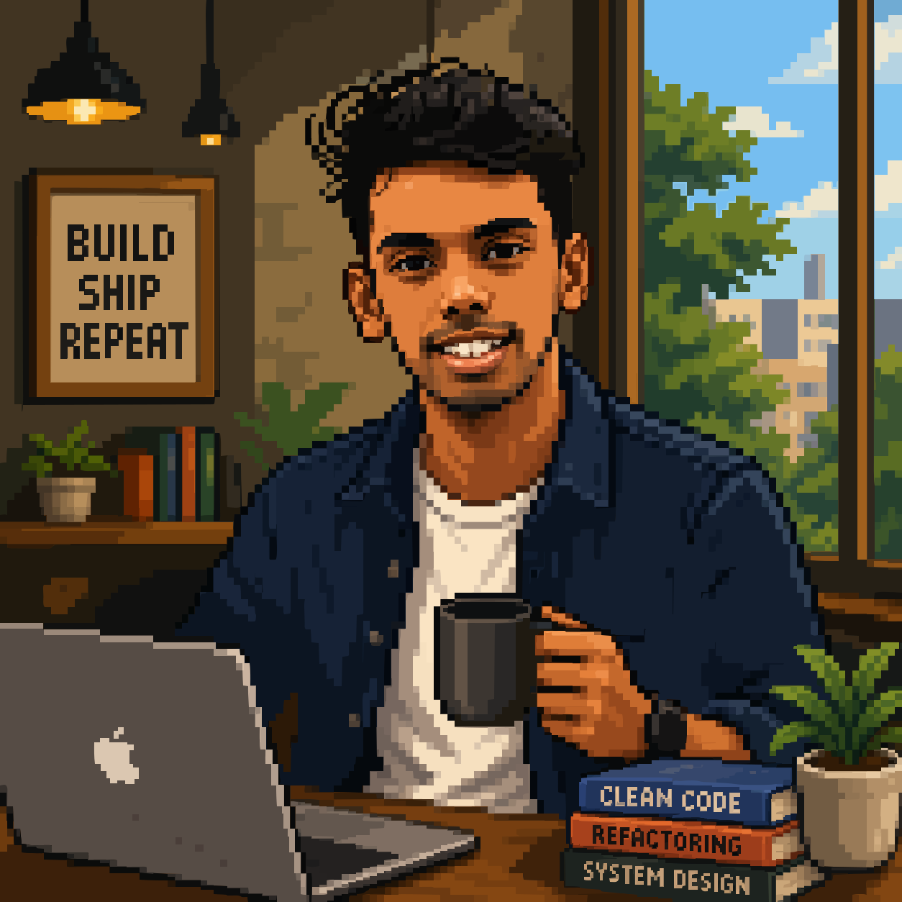
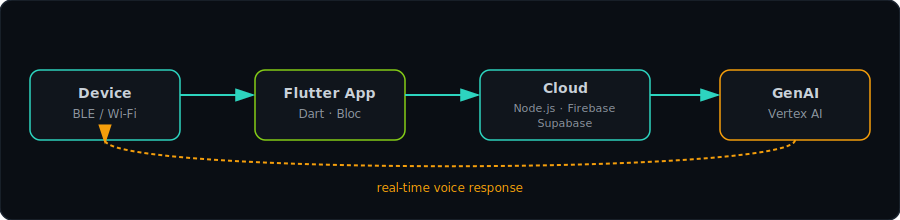

<table>
<tr>
<td width="230" align="center">

</td>
<td>

</td>
</tr>
</table>

&nbsp;&nbsp;&nbsp;&nbsp;&nbsp;
  
<b>📍 Kerala, India</b>

 

  

### How the pieces talk to each other

 

### `$ ls -la ~/projects --sort=impact`

<table>
<tr>
  <td align="center">
    
  </td>
  <td align="center">
    
  </td>
</tr>
<tr>
  <td align="center">
    
  </td>
  <td align="center">
    
  </td>
</tr>
</table>

 

 

  
   
  &nbsp;&nbsp;&nbsp;&nbsp;&nbsp;&nbsp;

